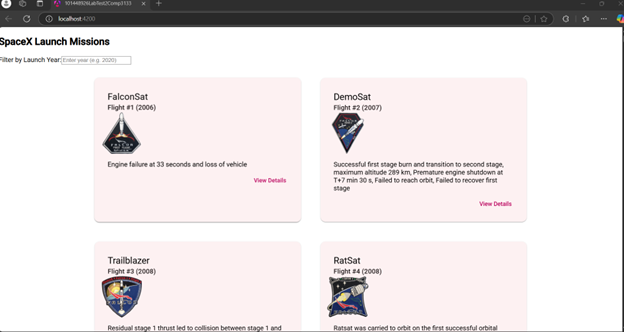
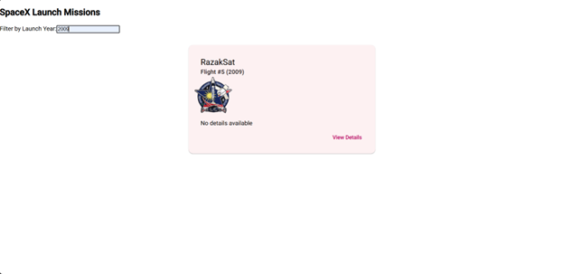
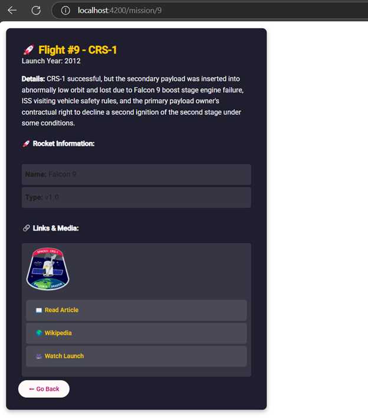
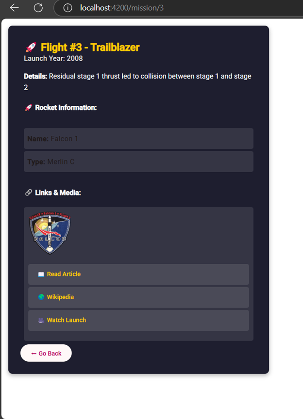

# Project Title

This is the second lab test of COMP 3133

## Screenshots

Here are some screenshots of the application:

## Usage

This lab test is to display the Space X launch missions from REST API endpoint with details and images.

## API
https://api.spacexdata.com/v3/launches

